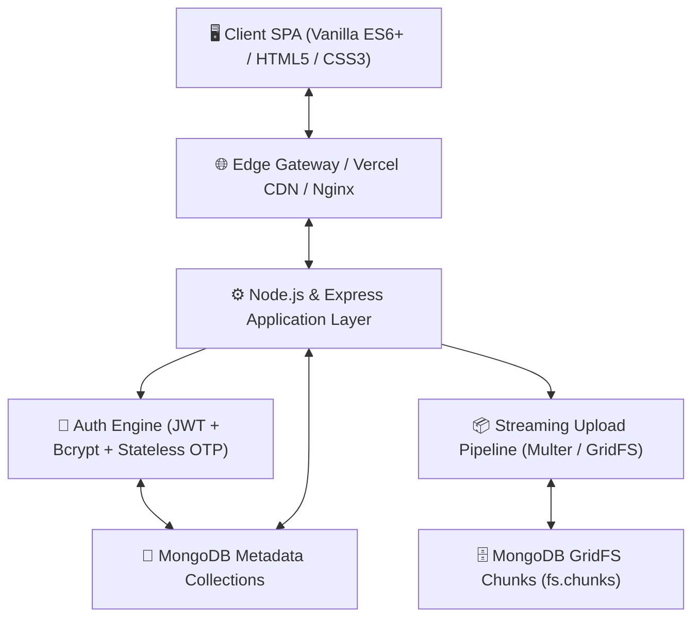

# ☁️ Nimbus Drive — Enterprise Cloud Media & File Storage Platform

[](https://nimbus-drive-gules.vercel.app)
[](https://nodejs.org)
[](https://expressjs.com)
[](https://mongodb.com)
[](https://docker.com)
[](https://nimbus-drive-gules.vercel.app)

> **Live Demo**: [https://nimbus-drive-gules.vercel.app](https://nimbus-drive-gules.vercel.app)  
> **Full Engineering Documentation**: [DOCUMENTATION.md](./DOCUMENTATION.md)  
> **Interview Prep & Architecture Guide**: [DOCUMENTATION.md#9-interview-preparation-guide-explaining-the-project](./DOCUMENTATION.md#9-interview-preparation-guide-explaining-the-project)

---

## 🌟 Overview

**Nimbus Drive** is a modern, high-performance cloud storage and media collaboration platform inspired by Google Drive and Dropbox. Engineered with **Node.js, Express, MongoDB (GridFS), and Vanilla ES6+ JavaScript**, it provides seamless file and folder organization, streaming binary uploads, in-browser media previews, revision history tracking, granular permission sharing, and automated audit logging.

---

## 🚀 Key Features

- 🔐 **Dual-Mode Authentication**: Phone OTP (with stateless JWT signatures) & Email/Password with bcrypt.
- 📂 **Virtual File Hierarchy**: Nested folders, instant breadcrumb navigation, and tree queries.
- ⚡ **Chunked Streaming Uploads**: Multer memory buffers piped directly into MongoDB GridFS (255KB chunks).
- 🎬 **In-Browser Media Previews**: Native streaming for PDFs, Images (PNG/JPG/SVG/WebP), Videos (MP4/WebM), Audio (MP3/WAV), and Syntax-highlighted code.
- 🔄 **Revision History & Versioning**: Immutable version records (`v1`, `v2`, `v3`) with historical downloads and rollback.
- 👥 **Granular Access Control**: Role-based permissions (`viewer` vs. `editor`) with folder inheritance.
- 🔗 **Expiring Public Share Links**: Tokenized public links with customizable expiration windows and password protection.
- 🗑️ **Soft Delete & Trash Bin**: Safe soft deletion, item recovery, and permanent empty trash purge.
- 📊 **Audit Activity Log**: Chronological audit trail of all file and security events.
- 📈 **Dynamic Storage Meter**: Live byte consumption calculation categorized by MIME types (Documents, Images, Media, Other).
- 📱 **100% Responsive Design**: Touch-friendly mobile sidebar drawer and adaptive grid/list views.
- 🛡️ **Offline Fallback Engine**: Automatic client-side mock persistence when network or server is disconnected.

---

## 🏗️ Architecture Diagram



---

## 🛠️ Quick Start

### Local Development
```bash
# 1. Clone repository
git clone https://github.com/yash69yadav/Nimbus-drive.git
cd Nimbus-drive

# 2. Install dependencies
npm install

# 3. Start local server
npm start
# App is running on http://localhost:4173
```

### Production Docker Container
```bash
# Build and run with Docker Compose
docker compose -f docker-compose.prod.yml up --build -d
```

---

## 📖 Complete Engineering & Interview Documentation

For detailed architectural deep dives, database Entity-Relationship Diagrams (ERD), API specifications, and interview question guides, read the complete documentation:

👉 **[Read Full Engineering Documentation (DOCUMENTATION.md)](./DOCUMENTATION.md)**

---

## 👨‍💻 Author & Contact

- **Developer**: Yash Yadav
- **GitHub**: [@yash69yadav](https://github.com/yash69yadav)
- **Live Deployment**: [https://nimbus-drive-gules.vercel.app](https://nimbus-drive-gules.vercel.app)

---

## 📄 Copyright & License

Copyright © 2024–2026 **Yash Yadav**. All Rights Reserved.  
Unauthorized copying, modifying, distributing, or commercial use of this project or its source code is strictly prohibited. See [LICENSE](./LICENSE) for details.

